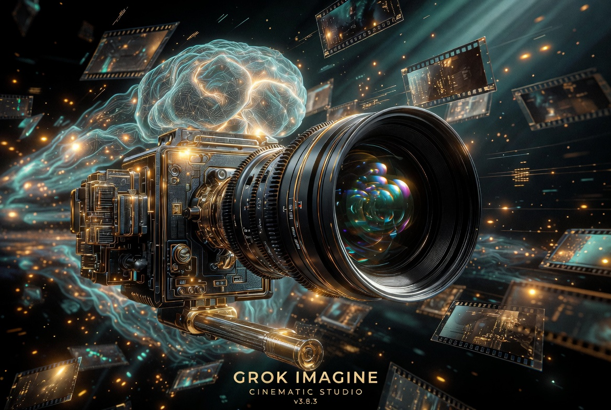
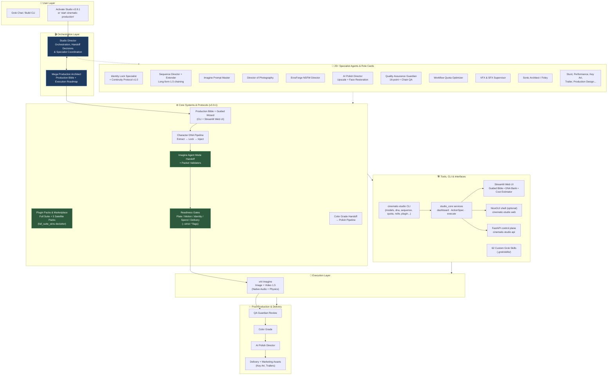
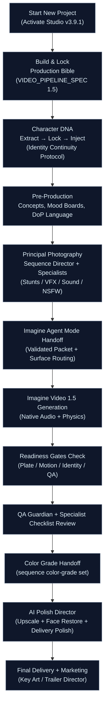
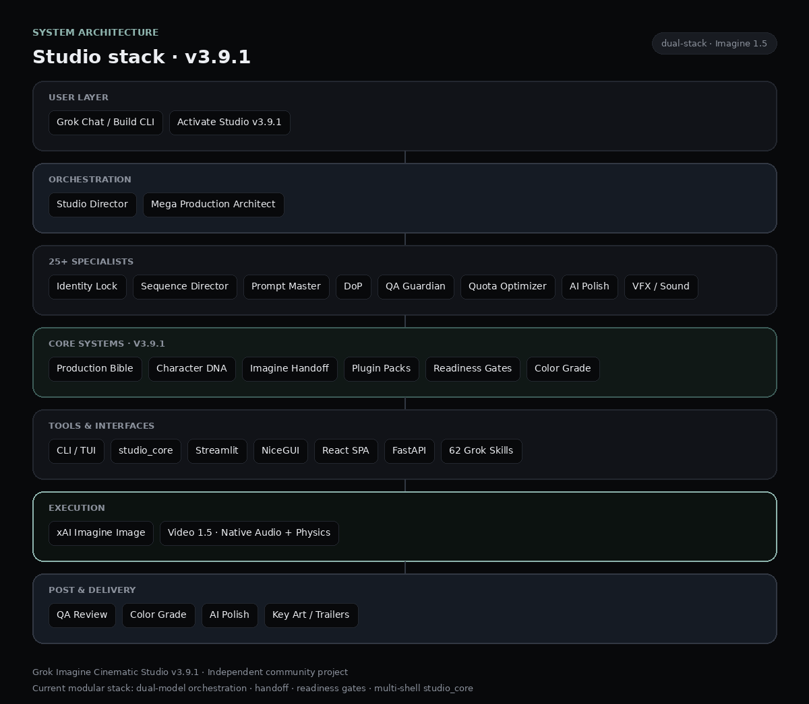
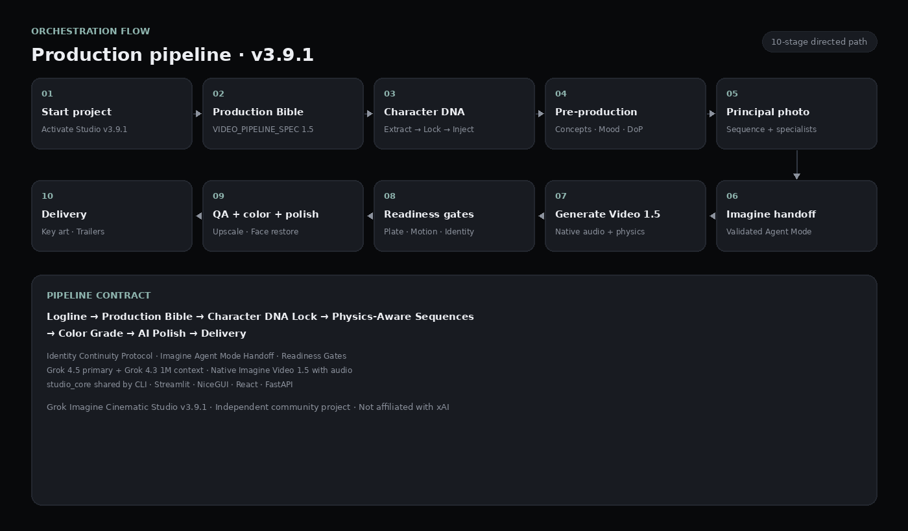
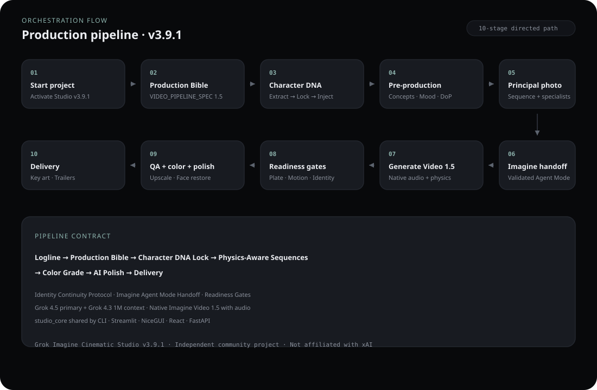

## 🎬 Grok Imagine Cinematic Studio

> **v3.9.1** — The most advanced multi-agent cinematic production system for Grok 4.5 Build + Grok 4.3 cinematic dual-stack

**Requires Grok Build ≥ 0.2.93** | **Native Imagine Video 1.5 support with synchronized audio**

<p align="center">
  
</p>

<p align="center">
  <strong>Logline → Production Bible → Character DNA Lock → Physics-Aware Sequences → Color Grade → AI Polish → Delivery</strong><br>
  <em>Emotionally powerful, identity-locked, production-ready cinematic content at Hollywood standards.</em>
</p>

<p align="center">
  <a href="https://github.com/FineComputer14451/Grok-Imagine-Cinematic-Studio/blob/main/LICENSE"></a>
  
  
  <a href="https://github.com/FineComputer14451/Grok-Imagine-Cinematic-Studio/stargazers"></a>
</p>

> [!NOTE]
> **Grok Imagine Cinematic Studio** is an **independent community project**. It is **not affiliated with, endorsed by, sponsored by, or officially connected to [xAI](https://x.ai)**. Grok, Grok Build, Grok Imagine, and related marks are trademarks of their respective owners. Full notice: **[DISCLAIMER.md](DISCLAIMER.md)**.

---

## ✨ What is Grok Imagine Cinematic Studio?

**Grok Imagine Cinematic Studio** is a complete, production-grade multi-agent framework that turns creative ideas into locked, emotionally resonant cinematic sequences using Grok 4.5 (primary) + Grok 4.3 (1M context) dual-stack orchestration and xAI’s Imagine models (Image + native Video 1.5 with audio).

It combines:

- **62 specialized Grok skills** powering a **25-agent core** cinematic department
- Professional **Production Bible** workflow (CLI wizard + Streamlit Web UI)
- **Character DNA extraction + Identity Continuity Protocol** for zero-drift consistency across stills, clips, and long sequences
- **Imagine Agent Mode Handoff** — validated routing from planning agents into Grok’s native generation surfaces
- End-to-end pipeline: pre-production → principal photography (sequences) → post (color → polish) → delivery + marketing assets
- Full support for both blockbuster SFW and artistically justified R-rated / NSFW productions

Whether you’re crafting Marvel-style hero reveals, cyberpunk neon sequences, intimate character studies, or epic trailers — the studio gives you director-level control, specialist collaboration, strict QA gates, and quota intelligence in one cohesive system.

---

## 🚀 What’s New in v3.9.1

- **TUI Home view modes** — `1` compact · `2` ops · `3` full · Tab cycle · `p` pause auto-refresh · action list filter
- **Streamlit Dashboard view modes** — same compact/ops/full density (session radio; TUI 1/2/3 parity)
- **Shared `studio_core` services** — UI-agnostic dashboard snapshot, ActionSpec registry, and `execute_action` (in-process / subprocess)
- **NiceGUI web shell** — `cinematic-studio web` (Dashboard · Production · DNA · Sequences · Imagine · Quota)
- **React / TanStack cockpit (v3.9.1)** — `cinematic-studio web-react` on FastAPI (guided Bible · Tools · Settings · ActionSpec SPA)
- **FastAPI control plane** — `cinematic-studio api` (`/v1/dashboard`, ActionSpec execute)
- Prior **3.8.8** — Operator UX control plane (readiness · convergence · delivery · handoff validate · Wave A packaging)

See full details in [CHANGELOG.md](CHANGELOG.md) and [docs/releases/RELEASE_NOTES_v3.9.1.md](docs/releases/RELEASE_NOTES_v3.9.1.md). Multi-shell web guide: [docs/guides/WEB_SHELLS.md](docs/guides/WEB_SHELLS.md).

---

## 🏗️ System Architecture (v3.9.1)

**Core Philosophy**: A modular "studio" of specialized agents that collaborate under the **Studio Director**, with strong handoff protocols, identity locking, readiness gates, and production discipline. The system bridges high-level creative direction (Grok chat/Build) with low-level execution (Imagine Image/Video 1.5) while maintaining full traceability and quota awareness.

### Updated Architecture Diagrams (v3.9.1)

These **Mermaid diagrams** are the current, live representation of the system. They reflect the plugin pack architecture, Imagine Agent Mode Handoff, Identity Continuity Protocol, color-grade → polish pipeline, and all readiness gates introduced through v3.9.1.


```mermaid
flowchart TB
    subgraph UserLayer["👤 User Layer"]
        GrokChat["Grok Chat / Build CLI"]
        Activate["Activate Studio v3.9.1<br/>or 'start cinematic production'"]
    end

    subgraph Orchestration["🎬 Orchestration Layer"]
        SD["Studio Director<br/>Orchestration, Handoff Decisions<br/>& Specialist Coordination"]
        MPA["Mega Production Architect<br/>Production Bible + Execution Roadmap"]
    end

    subgraph Specialists["🧠 25+ Specialist Agents & Role Cards"]
        direction TB
        IL["Identity Lock Specialist<br/>+ Continuity Protocol v1.0"]
        SEQ["Sequence Director + Extender<br/>Long-form 1.5 chaining"]
        PROMPT["Imagine Prompt Master"]
        DOP["Director of Photography"]
        NSFW["ErosForge NSFW Director"]
        POLISH["AI Polish Director<br/>Upscale + Face Restoration"]
        QA["Quality Assurance Guardian<br/>16-point + Chain QA"]
        QUOTA["Workflow Quota Optimizer"]
        VFX["VFX & SFX Supervisor"]
        SOUND["Sonic Architect / Foley"]
        OTHER["Stunt, Performance, Key Art,<br/>Trailer, Production Design..."]
    end

    subgraph Core["⚙️ Core Systems & Protocols (v3.9.1)"]
        PB["Production Bible + Guided Wizard<br/>(CLI + Streamlit Web UI)"]
        DNA["Character DNA Pipeline<br/>Extract → Lock → Inject"]
        HANDOFF["Imagine Agent Mode Handoff<br/>+ Packet Validators"]
        PLUGIN["Plugin Packs & Marketplace<br/>Full Suite + 5 Satellite Packs<br/>(full_suite_wins declutter)"]
        READINESS["Readiness Gates<br/>Plate / Motion / Identity / Spend / Delivery<br/>(--strict-* flags)"]
        COLOR["Color Grade Handoff<br/>→ Polish Pipeline"]
    end

    subgraph Tools["🛠️ Tools, CLI & Interfaces"]
        CLI["cinematic-studio CLI<br/>(models, dna, sequence, quota, nsfw, plugin...)"]
        CORE["studio_core services<br/>dashboard · ActionSpec · execute"]
        WEBUI["Streamlit Web UI<br/>Guided Bible • DNA Bank • Cost Estimator"]
        NICE["NiceGUI shell (optional)<br/>cinematic-studio web"]
        API["FastAPI control plane<br/>cinematic-studio api"]
        SKILLS["62 Custom Grok Skills<br/>(.grok/skills/)"]
    end

    subgraph Execution["🎥 Execution Layer"]
        IMAGINE["xAI Imagine<br/>Image + Video 1.5<br/>(Native Audio + Physics)"]
    end

    subgraph Post["✨ Post-Production & Delivery"]
        QA2["QA Guardian Review"]
        COLOR2["Color Grade"]
        POLISH2["AI Polish Director"]
        DELIVER["Delivery + Marketing Assets<br/>(Key Art, Trailers)"]
    end

    Activate --> SD
    SD <--> MPA
    MPA --> PB --> DNA
    DNA --> HANDOFF
    CLI --> CORE
    CORE --> WEBUI
    CORE --> NICE
    CORE --> API
    HANDOFF --> READINESS
    READINESS --> IMAGINE
    IMAGINE --> QA2 --> COLOR2 --> POLISH2 --> DELIVER

    SD -.-> Specialists
    Specialists -.-> Core
    Core --> Tools
    Tools --> Execution
    Execution --> Post

    classDef primary fill:#1e3a5f,stroke:#4a90d9,color:#fff
    classDef accent fill:#2d5a3d,stroke:#5cb85c,color:#fff
    class SD,MPA primary
    class HANDOFF,READINESS,PLUGIN accent
```

**Orchestration & Production Flow (v3.9.1)**


```mermaid
flowchart TD
    Start["Start New Project<br/>(Activate Studio v3.9.1)"] --> Bible["Build & Lock<br/>Production Bible<br/>(VIDEO_PIPELINE_SPEC 1.5)"]
    Bible --> DNA["Character DNA<br/>Extract → Lock → Inject<br/>(Identity Continuity Protocol)"]
    DNA --> PreProd["Pre-Production<br/>Concepts, Mood Boards, DoP Language"]
    PreProd --> Principal["Principal Photography<br/>Sequence Director + Specialists<br/>(Stunts / VFX / Sound / NSFW)"]
    Principal --> Handoff["Imagine Agent Mode Handoff<br/>(Validated Packet + Surface Routing)"]
    Handoff --> Generate["Imagine Video 1.5 Generation<br/>(Native Audio + Physics)"]
    Generate --> Gates["Readiness Gates Check<br/>(Plate / Motion / Identity / QA)"]
    Gates --> Review["QA Guardian + Specialist Checklist Review"]
    Review --> Color["Color Grade Handoff<br/>(sequence color-grade set)"]
    Color --> Polish["AI Polish Director<br/>(Upscale + Face Restore + Delivery Polish)"]
    Polish --> Deliver["Final Delivery + Marketing<br/>(Key Art / Trailer Director)"]

    classDef step fill:#0f172a,stroke:#64748b,color:#e0f2fe
    class Start,Bible,DNA,PreProd,Principal,Handoff,Generate,Gates,Review,Color,Polish,Deliver step
```

**Current visual diagrams (v3.9.1)**

Vector (SVG) and raster (PNG) exports of the same live architecture — dual-stack orchestration, Imagine Agent Mode Handoff, Identity Continuity Protocol, readiness gates, and multi-shell `studio_core`.

| Format | System architecture | Orchestration / production flow |
|--------|---------------------|----------------------------------|
| SVG | [`system_architecture_v3.9.1.svg`](assets/system_architecture_v3.9.1.svg) | [`orchestration_flow_v3.9.1.svg`](assets/orchestration_flow_v3.9.1.svg) |
| PNG | [`system_architecture_v3.9.1.png`](assets/system_architecture_v3.9.1.png) | [`orchestration_flow_v3.9.1.png`](assets/orchestration_flow_v3.9.1.png) |

<p align="center">
  
</p>

<p align="center">
  
</p>

<details>
<summary><strong>Visual references (expanded)</strong> — same diagrams, SVG sources for docs/print</summary>

<p align="center">
  
</p>

<p align="center">
  
</p>

</details>

**Updated ASCII Overview (v3.9.1)**

``` 
Grok Imagine Cinematic Studio v3.9.1  (Studio Director + 25+ Agents · Grok 4.5 primary)
├── .grok-plugin/                 # Marketplace manifests + plugin packs (full suite + 5 satellites)
├── references/agents/            # 25+ Role Cards, AGENT_INDEX, MODEL_LAYER, IDENTITY_CONTINUITY_PROTOCOL, IMAGINE_AGENT_MODE_HANDOFF
├── tools/                        # character_dna, sequence_chain, quota_optimizer, nsfw_*, bible_stages, imagine_bridge, handoff_schema, cli/
├── tools/cinematic_studio_cli.py   # Unified CLI (create-bible --wizard, dna, sequence, quota, nsfw, imagine, plugin, validate...)
├── references/MODELS_v3.6.md   # Dual-stack registry (grok-4.5 cinematic default)
├── studio_core/                  # UI-agnostic services (dashboard, ActionSpec, execute_action)
├── web_ui/app.py                 # Streamlit: DNA bank, live batch, NSFW, Community Cloud
├── web_nicegui/                  # Optional NiceGUI shell (cinematic-studio web)
├── web_react/                    # Optional React/TanStack SPA (cinematic-studio web-react)
├── web_academy/                  # Studio Academy — interactive learning companion
├── web_marketplace/              # Plugin Marketplace SPA (packs · skills · graph · live GitHub sync)
├── docs/academy/                 # Academy checklist + FAQ
├── studio_api/                   # Optional FastAPI control plane (cinematic-studio api)
├── examples/                     # Production Bible templates
├── MASTER_PROMPT.md              # Primary activation prompt (v3.8+ compatible)
├── scripts/                      # Release helpers & verify shims
└── .grok/skills/                 # 64 custom Grok skills (runtime engine)
```

**Key v3.9.1 Components**
- `references/agents/` — Authoritative Role Cards + protocols (Studio Director owns orchestration & handoff decisions)
- `references/agents/MODEL_LAYER_v4.5.md` + `IDENTITY_CONTINUITY_PROTOCOL_v3.8.md` — Operating rules + drift detection for every skill/agent
- `MASTER_PROMPT.md` — Activation entrypoint with Grok 4.5 stack + Imagine Agent Mode Handoff
- `tools/cli/bible_stages.py` + Web UI — Guided Production Bible wizard (multi-stage TTY or beautiful form UI)
- `tools/imagine_bridge.py` + handoff validators — Build validated `imagine_agent_mode_handoff` packets
- `.grok-plugin/` + `config/plugin_packs.yaml` — Full marketplace + pack system with `full_suite_wins` declutter
- `cinematic-studio` CLI — Power-user automation, plugin catalog management, preflight checks, strict gate enforcement

---

## 🎨 Visual Identity & Branding

**Refreshed Premium Cinematic Banner (v3.9.1)**

A brand new Hollywood-grade banner has been created specifically for v3.9.1. It features a massive cinematic camera lens with holographic AI elements, teal/steel accents, and premium film production aesthetics. The banner is in `assets/banner.jpg`.

The included `assets/logo.jpg`, `assets/logo-mark.png`, and `assets/favicon.jpg` complete the visual identity for Web UI, GitHub presentation, and favicon usage.

Current architecture / pipeline diagrams (v3.9.1):
- `assets/system_architecture_v3.9.1.png` + `.svg`
- `assets/orchestration_flow_v3.9.1.png` + `.svg`

Older v3.3 concept PNGs were retired in favor of these current exports.

### Cinematic Output Philosophy

Every generation targets:
- **Locked character identity** (DNA extraction → injection → continuity protocol)
- **Physics-aware motion** (especially native Imagine Video 1.5)
- **Native synchronized audio** & immersive sound design
- **Emotional micro-expression timing** and performance authenticity
- **Cinematic lighting, composition, and color** ready for color-grade → polish pipeline
- **Strict QA gates** before delivery (plate lock, motion brief, identity drift, specialist checklists)

---

## 🚀 Getting Started

### 1. Prerequisites
- Grok Build CLI ≥ **0.2.93**
- Access to Grok 4.5 (cinematic) and/or Grok 4.3 (1M context)
- xAI Imagine access (Image + Video 1.0 / 1.5)
- Python 3.12+ environment (for CLI + Web UI)

### 2. Activate the Studio (Primary Workflow)

In any Grok chat:

```
Activate Grok Imagine Cinematic Studio v3.9.1
```

or the shorter trigger:

```
start cinematic production
```

This loads the full **25-agent core** department with Production Bible support, Imagine Agent Mode Handoff, identity locking, and all specialists.

### 3. CLI Power Tools (Automation & Scripting)

```bash
# Verify model stack compatibility
cinematic-studio models verify

# Guided Production Bible (interactive wizard)
cinematic-studio create-bible --wizard

# Or non-interactive
cinematic-studio create-bible "My Epic Project Title"

# Character DNA pipeline
cinematic-studio dna init --name "Hero Name"
cinematic-studio dna lock

# Sequence management
cinematic-studio sequence init my-sequence
cinematic-studio sequence add-clip ...

# Quota intelligence & cost simulation
cinematic-studio quota estimate --video-seconds 45 --tier heavy

# Plugin marketplace
cinematic-studio plugin catalog
cinematic-studio plugin packs

# Interactive terminal UI (dashboard + launcher + cockpit)
cinematic-studio ui

# Optional NiceGUI web shell (requires requirements-nicegui.txt)
cinematic-studio web --port 8088
# Cockpit (press c): Bible, DNA init/lock/handoff, Sequence init/add-clip/handoff,
#   quota budget + sequence estimate, models verify / validate / stack
# Launcher (press l): status, lists, validate, stack, show DNA/sequence
# or: python tools/cinematic_studio_cli.py ui --interval 5
```

See full command reference in the [Quick Start Guide](docs/guides/Quick_Start_Guide.md) and run `cinematic-studio --help`.

### 4. Web UI (multi-run: Streamlit + NiceGUI + React + Academy + Marketplace)

All browser shells share `studio_core` (dashboard snapshot, ActionSpec, `execute_action`). Run any combination on different ports. Guide: [`docs/guides/WEB_SHELLS.md`](docs/guides/WEB_SHELLS.md).

**Streamlit** (default · Community Cloud · live batch):

```bash
streamlit run web_ui/app.py
```

- Character DNA Bank · live quota · live xAI batch (when `XAI_API_KEY` is set)
- Full NSFW planners · PDF report download · Community Cloud deploy

**NiceGUI** (optional · ActionSpec cockpit):

```bash
pip install -r requirements-nicegui.txt
cinematic-studio web --port 8088
# → http://127.0.0.1:8088/  ·  / production · dna · sequences · imagine · quota
```

**React / TanStack** (optional · SPA on FastAPI · v3.9.1):

```bash
pip install -r requirements-api.txt
cinematic-studio api --port 8090          # Terminal A
cinematic-studio web-react                # Terminal B → http://127.0.0.1:5173
# Pages: Dashboard · Production · DNA · Sequences · Imagine · Quota · Bible · Tools · Settings · NSFW
```

For a lightweight in-terminal live dashboard + safe command launcher (no browser), use `cinematic-studio ui`.

**HTTP API** (automation / React / custom UIs):

```bash
pip install -r requirements-api.txt
cinematic-studio api --port 8090
# OpenAPI → http://127.0.0.1:8090/docs
# GET /v1/dashboard · GET /v1/actions · POST /v1/actions/{id}/execute
# GET /v1/meta/* · GET/POST /v1/bible/*
```

Same ActionSpec safety model as the TUI (no free-form argv). See [`docs/PR9_STUDIO_API.md`](docs/PR9_STUDIO_API.md).


#### Studio Academy (interactive education)

```bash
cd web_academy
npm install
npm run dev
# → http://127.0.0.1:8080 — tiers, craft modules, quiz, graduate path
```

**Plugin Marketplace** (optional · browse packs / skills · local demo installs):

```bash
cd web_marketplace
npm install
npm run dev
# → http://127.0.0.1:8080 — Full suite + modular packs · skill browser · dependency graph
# Real CLI: grok plugin update grok-imagine-cinematic-studio
# Catalog syncs from .grok-plugin/marketplace.json on GitHub main
```

Companion docs: [`docs/academy/`](docs/academy/).

### 5. Full Documentation

- **[Official Documentation](docs/OFFICIAL_DOCUMENTATION.md)** — Canonical product manual (install, workflow, agents, CLI, packs, ops)
- **[Official Overview](docs/OFFICIAL_OVERVIEW.md)** — Short product introduction
- **[Docs Index](docs/README.md)** — Full documentation map
- **[Quick Start Guide](docs/guides/Quick_Start_Guide.md)** — Detailed activation, workflow phases, specialist table, pro tips
- **[UPGRADE_GUIDE.md](UPGRADE_GUIDE.md)** — Migration steps between versions
- **[CHANGELOG.md](CHANGELOG.md)** — Complete release history (highly recommended reading)
- **[MASTER_PROMPT.md](MASTER_PROMPT.md)** — The canonical activation prompt
- **Role Cards & Protocols**: `references/agents/AGENT_INDEX.md` and individual `.md` files
- **Production Bible Template**: `Project_Bible_Template.md` + `examples/`

---

## 📋 Recommended Production Workflow (High-Level)

1. **Activate Studio** → **Start New Project** → **Build & Lock Production Bible** (include `VIDEO_PIPELINE_SPEC` for 1.5 native audio)
2. **Pre-Production**: Character DNA extraction + lock, environment concepts, mood boards, DoP visual language
3. **Principal Photography**: Use Sequence Director + Extender for long-form; activate specialists (Stunts, VFX, Sound, Performance) as needed
4. **Review & Polish**: QA Guardian review → Color Grade handoff → AI Polish Director (upscale + face restore) → Delivery readiness gates
5. **Marketing Assets**: Key Art Designer + Trailer Director for posters, hero reveals, teasers

**Pro Tip**: Combine steps naturally, e.g.:
> "Activate Grok Imagine Cinematic Studio v3.9.1, start new project called 'VOIDWALKER', generate the full Production Bible with 1.5 video pipeline, lock the lead character DNA, and create the hero reveal key art."

---

## 🧠 Core Specialists (Activation Commands)

| Specialist                        | Activation Command                      | Primary Strength                          |
|-----------------------------------|-----------------------------------------|-------------------------------------------|
| Studio Director                   | `ACTIVATE STUDIO_DIRECTOR`              | Overall orchestration & handoff decisions |
| Mega Production Architect         | `ACTIVATE MEGA_PRODUCTION_ARCHITECT`    | Full Production Bible + execution roadmap |
| Identity Lock Specialist          | `ACTIVATE IDENTITY_LOCK`                | Character DNA, continuity, drift detection|
| Imagine Prompt Master             | `ACTIVATE IMAGINE_PROMPT_MASTER`        | Photorealistic prompt engineering (1.5)   |
| Director of Photography           | `ACTIVATE DOP`                          | Cinematic lighting, camera choreography   |
| Sequence Director                 | `ACTIVATE SEQUENCE_DIRECTOR`            | Long-form sequencing & 1.5 extend/stitch  |
| Cinematic Sequence Extender       | `ACTIVATE SEQUENCE_EXTENDER`            | 60–180s+ seamless expansions             |
| ErosForge NSFW Director           | `ACTIVATE EROSFORGE`                    | Artistic R-rated / intimate scenes        |
| AI Polish Director                | `ACTIVATE AI_POLISH_DIRECTOR`           | Final upscale, face restoration, delivery |
| Workflow Quota Optimizer          | `ACTIVATE WORKFLOW_OPTIMIZER`           | Real-time cost, risk, budget management   |
| Quality Assurance Guardian        | `ACTIVATE QA_GUARDIAN`                  | 16-point weighted QA + chain QA           |
| VFX & SFX Supervisor              | `ACTIVATE VFX_SFX_SUPERVISOR`           | Particles, creatures, destruction         |
| Sonic Architect / Foley           | `ACTIVATE SONIC_ARCHITECT`              | Native audio design & realistic foley     |

*Full list and detailed Role Cards in `references/agents/AGENT_INDEX.md`*

---

## 🔧 CLI & Tooling Highlights

- `cinematic-studio create-bible --wizard` — Interactive guided Production Bible
- `cinematic-studio ui` — Interactive terminal TUI (live dashboard + cascade/alignment, launcher, cockpit: Bible/DNA/sequence scaffold, **quota sync** (`s` on home), validate/stack; no Imagine spend)
- `cinematic-studio dna ...` — Full character DNA lifecycle (init, extract, lock, handoff, inject)
- `cinematic-studio sequence ...` — Init, add clips, handoff, extend, qa, color-grade, polish, deliver
- `cinematic-studio quota ...` — Estimate, dashboard, optimize, record spend
- `cinematic-studio nsfw ...` — Dedicated NSFW batch planning, quota orchestration, physics QA
- `cinematic-studio imagine agent-handoff` — Emit validated handoff packets for native Imagine execution
- `cinematic-studio plugin catalog pin` / `check --release` — Release hygiene for the Grok plugin marketplace
- `cinematic-studio validate` — Project health & strict gate checks

All commands support `--help` and rich output. Many also have direct Python entrypoints under `tools/cli/`.

---

## 📄 Documentation & Further Reading

| Resource                              | Path                                              | Purpose                                      |
|---------------------------------------|---------------------------------------------------|----------------------------------------------|
| Official Documentation                | `docs/OFFICIAL_DOCUMENTATION.md`                  | Canonical product manual                     |
| Official Overview                     | `docs/OFFICIAL_OVERVIEW.md`                       | Short product introduction                   |
| Quick Start Guide                     | `docs/guides/Quick_Start_Guide.md`                | Complete onboarding + workflow + tips        |
| UPGRADE_GUIDE                         | `UPGRADE_GUIDE.md`                                | Version migration notes                      |
| CHANGELOG                             | `CHANGELOG.md`                                    | Detailed release notes (start here)          |
| MASTER_PROMPT                         | `MASTER_PROMPT.md`                                | Primary chat activation prompt               |
| Agent Index & Role Cards              | `references/agents/AGENT_INDEX.md`                | Every specialist’s capabilities & triggers  |
| Production Bible Template             | `Project_Bible_Template.md`                       | Professional structured template             |
| Models Registry                       | `references/MODELS_v3.6.md`                       | Dual-stack model slugs & pricing             |
| Kink-Specific Cinematic Template      | `Kink_Specific_Cinematic_Template_Library_v3.3.md`| NSFW artistic standards & prompt library     |

---

## 🤝 Contributing

This project is under active development. Contributions are welcome!

- New specialist agents / Role Cards
- Prompt engineering improvements & MASTER_PROMPT refinements
- Additional CLI commands or Web UI features
- Documentation, examples, and Production Bible templates
- Bug reports, strict-gate test cases, and edge-case handling

Please read [CONTRIBUTING.md](CONTRIBUTING.md) and [CODE_OF_CONDUCT.md](CODE_OF_CONDUCT.md) before submitting PRs.

For major architectural changes, open an issue first to discuss alignment with the Studio Director’s vision and handoff protocols.

---

## ⚖️ Disclaimer & independence

> [!NOTE]
> **Grok Imagine Cinematic Studio** is an **independent community project**. It is **not affiliated with, endorsed by, sponsored by, or officially connected to xAI**.

**Summary (expanded):**

| Topic | What it means |
|-------|----------------|
| **Independence** | Community-maintained orchestration suite (skills, agents, CLI, Web UI). Not an official xAI product. |
| **Trademarks** | “Grok,” “Grok Build,” “Grok Imagine,” “xAI,” and related names are used only to describe interoperability with third-party platforms. |
| **APIs & billing** | Keys, quotas, pricing, and access terms are solely between you and xAI (or your host platform). This project does not sell or guarantee API access. |
| **No warranty** | MIT **as is** — see [LICENSE](LICENSE). Outputs need your own QA before delivery. |
| **Your responsibility** | Laws, platform policies, copyright of references, age restrictions, and optional NSFW workflows. |

Canonical full text: **[DISCLAIMER.md](DISCLAIMER.md)**.

---

## 📜 License

This project is licensed under the **MIT License** — see [LICENSE](LICENSE) for details.

---

<p align="center">
  <strong>Built for creators who want cinematic AI that feels directed, not just generated.</strong><br>
  <em>Grok Imagine Cinematic Studio v3.9.1 — August 2026 · Independent community project · Not affiliated with xAI</em>
</p>

---

**Ready to direct your next masterpiece?**

Just say: **"Activate Grok Imagine Cinematic Studio v3.9.1"** and begin.
